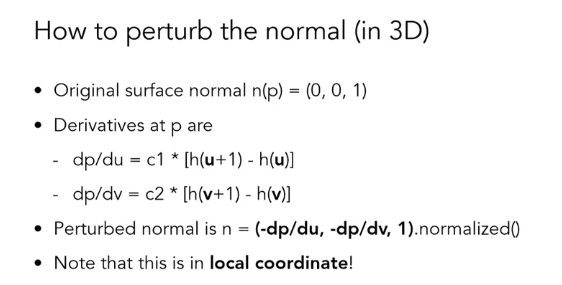

# 贴图

例如我们有个基本的 `岩石贴图`，在`平面`上，如果这时添加光源，由于 平面的法向是固
定的，计算照明时，无法体现岩石表面的法向，从而光照不准确

前提 要有 `足够的 三角面`，通过调整 uv 坐标达到贴图的各种变换（平移，旋转，中心
）

# 法线贴图

为基本的贴图设置对应的法向，而不是采用 mesh 自身的法向，使表面在光照下更加真实

- 由于法向 xyz 是归一化的，存贮只需要存两个分量即可，需要判断是否需要计算第 3 个
  分量

- 要将 [-1, 1] 的法向 map 到 [0, 1] 存贮，读取使用是需要映射回来

- 通过读取的法向和平坦 (0,0,1) 进行`法向强度插值`，可以调节

- 法向是在
  `切线空间(顶点切向、副切向(是由UV决定的，根据顶点和uv坐标可以计算切线)，顶点法向)`
  的，需要装换成 `世界坐标`，十分简单的坐标系变换
  https://zhuanlan.zhihu.com/p/139593847

说白了 `T` 和 `B` 就是一组非正交基（基可以进行正交化，变成正交基），在这组基下，
片元中的点的坐标就是点在 UV 平面的坐标 （以顶点为原点）

# 高度贴图，置换贴图

存储为 0-1 的灰度图，可以通过高度强度缩放，类似深度图，是沿着 mesh 的法向偏移

# 基于图像的光照 IBL

Imaging Based Lighting 环境光可以直接加一个颜色，但更加真实的是，根据外界环境添
加环境光，例如天空盒子，其采样过程是通过 `法向指向天空盒子的哪个地方的颜色`作为
漫射环境光， `view方向反射后指向天空盒子的哪个地方的颜色` 作为 镜面环境光

- 光泽设置通过采样 `tex2Dlod` 不同 MIP 图像

# 其他贴图

## 凹凸贴图 Bump

- 视觉原理：所以向上倾的地方就会更亮，而向下倾的地方就会更暗，因此可以通过高度判
  断物体的凹凸情况。
- 存贮方式：最通常的方法是通过存储`高度值`实现，我们要用到一个灰色的纹理图
  ，`灰色的亮度`体现出每个点分别凸出多少

那么如何通过 Bump 图计算出法向呢？，通过 高度值在 (u,v) 方向的导数，来更新局部法
向

https://zhuanlan.zhihu.com/p/369327667
https://gamedev.stackexchange.com/questions/174642/how-to-write-a-shader-that-only-uses-a-bump-map-without-a-normal-map
