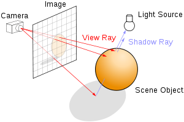
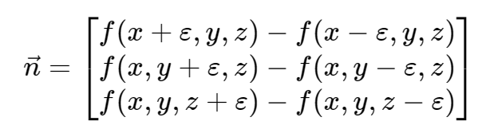
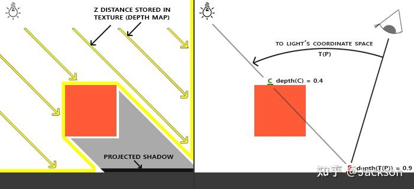

- 没有光我们就什么都看不见
- 没有环境中的物体，我们也看不见光

# Ray Tracking

英文
：https://www.scratchapixel.com/lessons/3d-basic-rendering/introduction-to-ray-tracing/raytracing-algorithm-in-a-nutshell.html

中文：https://blog.csdn.net/weixin_42680627/article/details/117442777

不同表面对光子的作用：

- 击中漫反射表面的光子，可以被反射到在以`接触点处的法线为中心的半球内的任意方向`
- 如果表面是镜面，且不具有漫反射特性，光线就只能被反射到精确的方向，也就是
  `对称后的方向`

Ray(Path) Tracking:

- 前向光线追踪（`Forward ray tracing or light tracing`）：模拟从光源发出光子，光
  子反射到成像平面，增加该点亮度，但缺点如下

  - 光子反射方向不定，难以模拟全部的光子方向
  - 无法判断程序停止，这意味着我们需要在渲染时一直盯着这个物体


- 反向光线追踪（`backward ray-tracing or eye tracing`）：模拟从成像平面发出光子
  击中物体，再从该点发射一条线（称作“光线”(light ray)或“影线”(shadow ray)）计算
  该点接受了多少从光源而来的光能


如何判断光线与物体相交，可以使用对场景进行不同的构造，例如划分区域，来加速相交检
测过程

# Ray Marching

https://jamie-wong.com/2016/07/15/ray-marching-signed-distance-functions/

https://iquilezles.org/articles/distfunctions/ SDF 函数库

- 提供了与光追不同的思路来渲染三维物体，通过 `SDF + Step in` 可以十分轻易判断光
  线与物体相交
- Tracking 中整个场景是由 `显式几何` 来描述的，而 Marching 中整个场景是由
  `SDF 函数（隐式几何）` 来描述的

<center>



</center>

## 计算法向

证明过程：https://www.zhihu.com/question/278342330/answer/674631170

数值模拟：https://iquilezles.org/articles/normalsSDF/

不同于显式几何给出的顶点法线，在 Ray Marching 中需要`根据 SDF 来计算法向`，其实
就是`计算梯度`



## 摄像机移动

注意我们是通过 I want the camera to be at this point, looking at this other
point 这种方式来控制摄像机

- given the eye point
- the camera target
- an up vector.

将 Ray 通过一个矩阵变换到世界坐标系，也就是 viewMatrix

## 几何相交

通过 SDF 来进行几何物体的相交，如`交集、并集、差集`

## 物体变换

## translate and rotate

To translate or rotate a surface modeled as an SDF, you can apply the
`inverse transformation to the point` before evaluating the SDF.

### Uniform Scaling

主要缩放 SDF($\textbf{p}$)，需要使用 $SDF(\frac{\textbf{p}}{S})$，对物体放大 $S$
倍，但是当 $S<1$ 时，进行步进的时候可能跨过这种小物体，因此也需要同时缩放步长
$$S*SDF(\frac{\textbf{p}}{S})$$

### Non-uniform scaling

$$min(s_x, s_y, s_z)*SDF(\frac{\textbf{p}}{vec3(s_x, s_y, s_z)})$$

# soft shadow

https://iquilezles.org/articles/rmshadows/

在 `ray marching` 中的 阴影计算：通常来说，当要计算某点 `p` 的阴影信息时，我们可
以通过朝着 `light vector` 进行 `raymarch`

- 直到找到物体相交，则输出 `0` 代表阴影，否则输出 `1` 代表非阴影，但是完全输出
  `1` 代表非阴影，会导致 `0-1 过渡的硬阴影`

- 在没有与物体相交前，但是很接近的情况下，那么我们会考虑该点在半影区，一是距离相
  交点越近 `h`，通常阴影越深颜色越暗。二是距离着色点越近(也就是距离光源也远
  )`t`，阴影颜色也越深

```c
float softshadow( in vec3 ro, in vec3 rd, float mint, float maxt, float k )
{
    float res = 1.0;
    for( float t=mint; t < maxt; )
    {
        float h = map(ro + rd*t);  // ro 物体点，rd 光线
        if( h<0.001 )       // 相交
            return 0.0;
        res = min( res, k*h/t );  // h 越小，离物体越近，t越大，离光源越近，返回的值越小
        t += h;
    }
    return res;
}
```

https://zhuanlan.zhihu.com/p/45805097

https://webglfundamentals.org/webgl/lessons/webgl-shadows.html

在 光追中的 阴影计算通常是通过 `Shadow Map` 实现的

- pass-1：以光源的位置看场景，产生一个只存 depth 的 map
- pass-2：以摄影机的视角来看场景，用摄影机的 depth 和 shadow map depth 比对，按
  对比结果，绘制阴影



# Ambient Occlusion

AO 贴图：判断是否遮挡关系，在 `ray marching` 中的 AO 计算：通常来说，当要计算某
点 `p` 的 AO 信息时，我们可以通过朝着 `normal vector` 进行 `raymarch`
